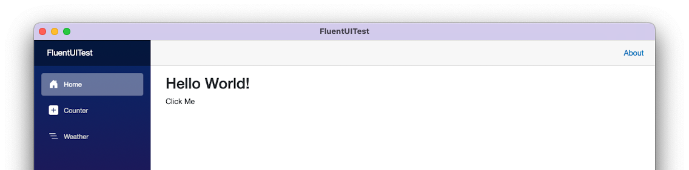
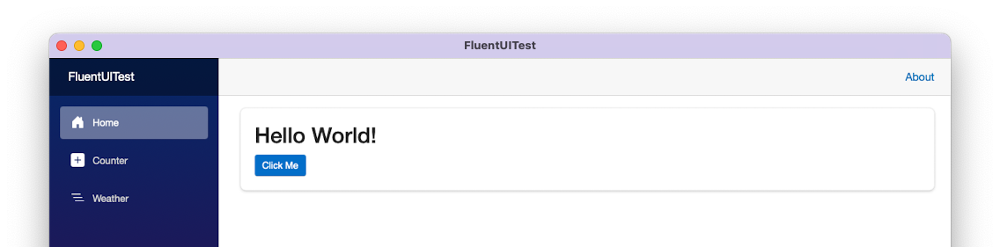

# FluentUITest

Test project to show the reproduction for https://fluentui-blazor.net/CodeSetup#blazor-hybrid.

The workaround should not be needed anymore, unfortunately we still do, so this problem does not seem to be (entirely) fixed.

The workaround is right now (commented) in [index.html](wwwroot/index.html).

Running the app without the workaround shows you this

Running the app with the workaround shows you this

## Relevant links

* https://github.com/microsoft/fluentui-blazor/issues/404
* https://github.com/dotnet/maui/issues/15234
* https://github.com/dotnet/maui/pull/18953